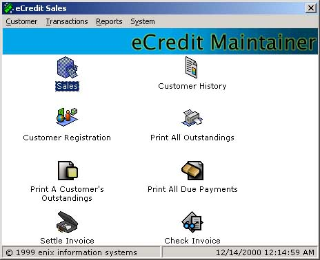



## CreditPro

### Description

Helps to maintain credit customers, with the details of bills and outstanding balance, etc. Useful for small companies, total solution. No need to purchase big software which has got too much unwanted functions for which you don't need to pay for. The code has got very useful stuff like managing ADO DB, creating reports, etc... hope you like the code and most of all the application. Most of the reported bugs are fixed (which were a few ui bugs). Check out now the update.
 
### More Info
 

             |
---                |---
**Submitted On**   |2000-12-28 22:56:58
**By**             |[Sofwathullah Mohamed](https://github.com/Planet-Source-Code/PSCIndex/blob/master/ByAuthor/sofwathullah-mohamed.md)
**Level**          |Intermediate
**User Rating**    |4.8 (96 globes from 20 users)
**Compatibility**  |VB 6\.0
**Category**       |[Databases/ Data Access/ DAO/ ADO](https://github.com/Planet-Source-Code/PSCIndex/blob/master/ByCategory/databases-data-access-dao-ado__1-6.md)
**World**          |[Visual Basic](https://github.com/Planet-Source-Code/PSCIndex/blob/master/ByWorld/visual-basic.md)
**Archive File**   |[CODE\_UPLOAD1313412292000\.zip](https://github.com/Planet-Source-Code/sofwathullah-mohamed-creditpro__1-13570/archive/master.zip)

